# Ride-Hailing Fleet Operations - Data Engineering Platform

An end-to-end **Kappa-architecture** data platform for a ride-hailing operator.
It streams live GPS/trip telemetry, ingests a daily vehicle-expense batch,
and answers the business question:

> **What is fleet utilization and earnings by area and time of day right now,
> and which vehicles are becoming unprofitable once yesterday's fuel and
> maintenance costs are factored in?**

Everything runs with **one command** (`docker compose up -d`) and is observable
through structured logs, Prometheus metrics/alerts and a provisioned Grafana
dashboard.

EC8203 Applied Big Data Engineering — Mini Project (Use Case 1: Ride-Hailing Fleet Operations).

---

## Contents

1. [Architecture](#1-architecture)
2. [Technology stack](#2-technology-stack)
3. [Simulated clock](#3-simulated-clock)
4. [Quick start](#4-quick-start)
5. [Using the platform](#5-using-the-platform)
6. [Observability](#6-observability)
7. [Results (screenshots)](#7-results-screenshots)
8. [Real scenarios we tested](#8-real-scenarios-we-tested)
9. [Automated tests](#9-automated-tests)
10. [Configuration](#10-configuration)
11. [Troubleshooting](#11-troubleshooting)
12. [Project structure](#12-project-structure)
13. [Known limitations](#13-known-limitations)

---

## 1. Architecture

**Kappa architecture:** both sources — the continuous telemetry stream *and*
the once-a-day expense file — are published to **Kafka**, and a **single Spark
Structured Streaming job** processes them. There is no separate batch layer
re-implementing the same logic; the daily batch is just another stream.
**Airflow** orchestrates the daily expense feed and the profitability
reconciliation, which joins the two sources for one simulated day.

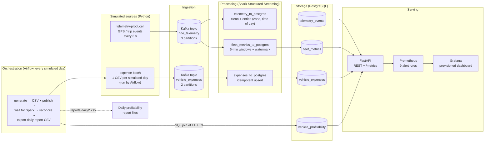

**Why Kappa and not Lambda?** One processing path means one implementation of
the cleaning/aggregation logic, no speed/batch consistency problem, and the
ability to recompute by replaying Kafka. The daily expense source is small
(25 records/day), so treating it as a stream costs nothing. The full argument,
including the rejected Lambda alternative, is in the project report.

## 2. Technology stack

| Layer | Technology | Role in this project |
|---|---|---|
| Sources | Python 3.12 (`producers/`) | Telemetry simulator (25 vehicles, Colombo) and daily expense generator |
| Ingestion | Apache Kafka 3.9 (KRaft) | Durable, replayable event log for both sources |
| Processing | Apache Spark 3.5.7 Structured Streaming | Cleaning, enrichment, 5-minute windowed aggregation, sinks |
| Orchestration | Apache Airflow 2.10 | Daily expense batch + profitability reconciliation + report export |
| Storage | PostgreSQL 16 | Queryable store for events, metrics, expenses, profitability |
| Serving | FastAPI | REST endpoints, daily report API, Prometheus `/metrics` |
| Monitoring | Prometheus + Grafana | Metrics, 9 alert rules, provisioned dashboard |
| Packaging | Docker Compose | Whole platform in 9 containers, one command |

## 3. Simulated clock

To demonstrate daily behaviour in a short session, time is compressed:

| Real time | Simulated time |
|---|---|
| **5 minutes** | **1 day** (288× speed) |
| 3 seconds (one telemetry batch) | ≈ 14.4 minutes |
| 1 minute | ≈ 4.8 hours |

- The simulation starts at **2026-09-28 00:00** (`SIMULATION_START_DATE`).
- All components share **one clock anchor**, the file
  `data/processed/simulation_epoch.txt`, created by whichever process starts first.
  The producer and Airflow therefore always agree on "what day is it".
- The Airflow DAG runs every 5 real minutes and processes **yesterday** (the
  most recently completed simulated day).
- **Restart the simulation from day 1:** stop the stack and delete
  `data/processed/simulation_epoch.txt`.

## 4. Quick start

### Prerequisites

- **Docker Desktop** (with Docker Compose v2), at least **8 GB RAM** assigned
- **Git**
- *Optional:* Python 3.12 — only for running the tests and the log viewer

### Run it

```bash
git clone https://github.com/prabhathmanthilaka/ride-hailing-data-engineering-platform.git
cd ride-hailing-data-engineering-platform
docker compose up -d --build
```

No `.env` file is needed - every setting has a default (see [Configuration](#10-configuration)).

The first start takes **5–10 minutes** (images are built and Spark downloads
its Kafka/PostgreSQL drivers). Then:

| After | What you should see |
|---|---|
| ~1 min | `docker compose ps` shows 8 services `Up`, `ride-kafka-init` `Exited (0)` |
| ~3–4 min | Telemetry flowing: `curl http://localhost:8000/metrics` → `ride_telemetry_last_event_age_seconds` under ~30 |
| ~10 min | First daily reconciliation: `curl http://localhost:8000/reports/daily/latest` → `"report_date": "2026-09-28"` |

### Open the UIs

| Service | URL | Login |
|---|---|---|
| **Grafana dashboard** | http://localhost:3000 | `admin` / `admin` (skip the password change) |
| API docs (Swagger) | http://localhost:8000/docs | – |
| Prometheus alerts | http://localhost:9090/alerts | – |
| Airflow | http://localhost:8080 | `admin` / password from `docker exec ride-airflow cat /opt/airflow/standalone_admin_password.txt` |
| PostgreSQL | `localhost:5433`, db `ride_hailing` | `ride_admin` / `ride_password` |
| Kafka (from the host) | `localhost:9092` | – |

In Grafana: **Dashboards → Ride-Hailing Fleet Operations & Platform Monitoring**
(provisioned automatically from `monitoring/grafana/provisioning/`).

> If Grafana shows `ChunkLoadError`, your browser cached files from an older
> Grafana on the same address — press **Ctrl + Shift + R**.

### Stop / reset

```bash
docker compose down          # stop, keep all data
docker compose down -v       # stop and DELETE all data (full reset)
```

For a full reset also delete `data/processed/simulation_epoch.txt` so the
simulation starts again from 2026-09-28.

## 5. Using the platform

### API endpoints

| Endpoint | Answers |
|---|---|
| `GET /fleet/utilization` | Current active / idle / enroute / on-trip vehicles and idle ratio **per zone** |
| `GET /fleet/earnings` | Trips and earnings **by zone and time of day** (final fare per trip) |
| `GET /vehicles/profitability?limit=25` | Per-vehicle daily reconciliation rows |
| `GET /reports/daily/latest` | **Consolidated daily profitability report**: fleet totals, status counts, unprofitable/at-risk vehicles |
| `GET /alerts/idle-vehicles?threshold_minutes=180` | **Threshold-based idle alert**: vehicles idle longer than N simulated minutes |
| `GET /alerts` | Vehicles flagged for service or unprofitable |
| `GET /health` | API + database health (503 if PostgreSQL is down) |
| `GET /metrics` | Prometheus metrics (fleet, earnings, profitability, idle, freshness, HTTP) |

```bash
curl http://localhost:8000/reports/daily/latest
curl "http://localhost:8000/alerts/idle-vehicles?threshold_minutes=60"
```

### Daily outputs

Every simulated day Airflow produces two files:

- `data/incoming/vehicle_expenses_<date>.csv` - the dropped daily expense file
- `reports/daily/profitability_report_<date>.csv` - the **daily per-vehicle
  profitability reconciliation report**, least profitable vehicle first

Profitability rule: `profit = earnings − fuel − maintenance`;
**UNPROFITABLE** if profit < 0, **AT_RISK** if margin < 10 %, else **PROFITABLE**.
Earnings use the **final fare of each trip** (the fare field is cumulative while
a trip is running).

## 6. Observability

### Structured logs (every stage)

Every component writes one JSON object per line with the same fields:

```json
{"ts": "2026-09-30T07:10:44.989Z", "level": "INFO", "service": "expense-pipeline",
 "stage": "storage", "event": "expenses_landed_check", "expense_date": "2026-10-26",
 "landed": 25, "expected": 25, "complete": true}
```

| Service | Stages | Where |
|---|---|---|
| `telemetry-producer` | ingestion | `logs/telemetry-producer.log`, `docker logs ride-telemetry-producer` |
| `expense-pipeline` (Airflow) | ingestion, storage, processing, serving, orchestration | `logs/expense-pipeline.log` |
| `spark-streaming` | processing (per-batch progress, throughput, watermark), storage (writes) | `docker logs ride-spark` |
| `ride-api` | serving (requests, 5xx causes) | `docker logs ride-api` |

**One merged timeline across all components:**

```bash
python tools/pipeline_logs.py                          # last 5 minutes
python tools/pipeline_logs.py --since 30 --level ERROR # only errors
python tools/pipeline_logs.py --stage storage          # every database write
python tools/pipeline_logs.py --service spark-streaming --event query_progress
```

### Metrics and alerts

Prometheus scrapes the API every 5 s. **9 alert rules** in 3 groups
(`monitoring/alert_rules.yml`):

| Alert | Fires when | Purpose |
|---|---|---|
| `TelemetryDataStale` | no telemetry stored for > 60 s (for 30 s) | **"no data received in N minutes"** |
| `ProfitabilityReportStale` | no reconciliation for > 15 min | batch pipeline stopped |
| `VehicleIdleTooLong` | a vehicle idle > 180 simulated minutes | **use-case idle alert** |
| `FleetIdleRatioHigh` | > 60 % of the fleet idle for 1 min | supply exceeds demand |
| `UnprofitableVehiclesHigh` | ≥ 5 unprofitable vehicles on the latest day | profitability |
| `FleetDailyLoss` | fleet profit < 0 on the latest day | profitability |
| `APIHealthDown`, `DatabaseUnavailable`, `APIDown` | API/DB unhealthy or not scrapeable | platform health |

## 7. Results (screenshots)

All screenshots are from the running system.

**Alerts & Operations** — firing-alert count, active alerts and longest-idle vehicles (dashed lines = 120 / 180-minute thresholds):

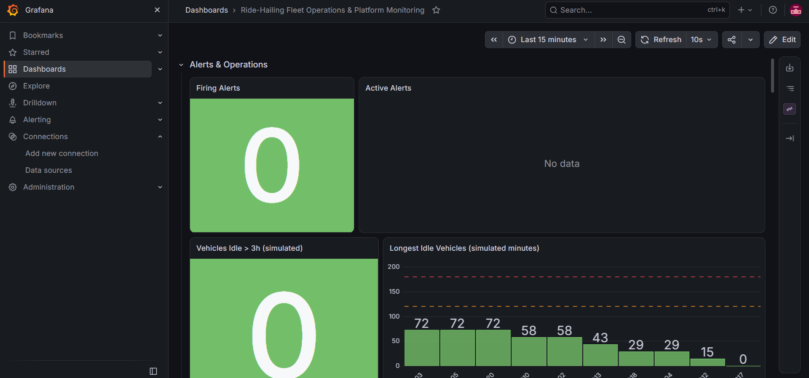

**Platform & Pipeline Health** — health tiles, telemetry freshness (red line = 60 s alert threshold) and ingestion throughput:

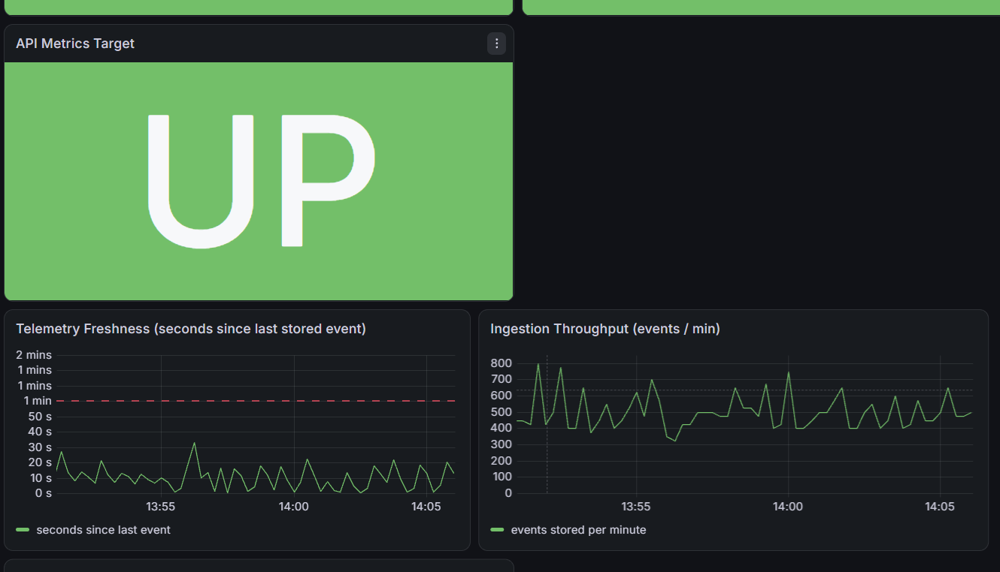

**API Performance** — request rate, P95 latency (red line = 1 s target) and 5xx error rate per endpoint:

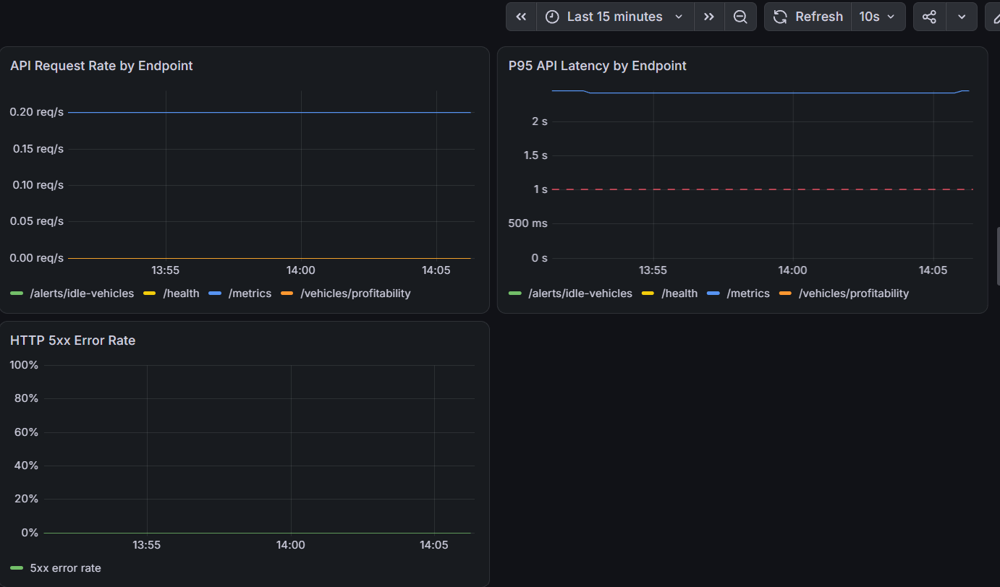

**Fleet Operations** — utilization and idle-ratio gauges with business thresholds, fleet state, vehicles by zone:

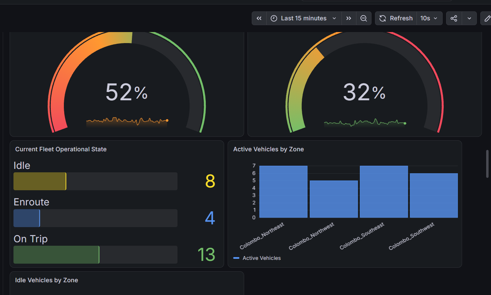

**Fleet Earnings** — earnings and trips by zone and time of day:

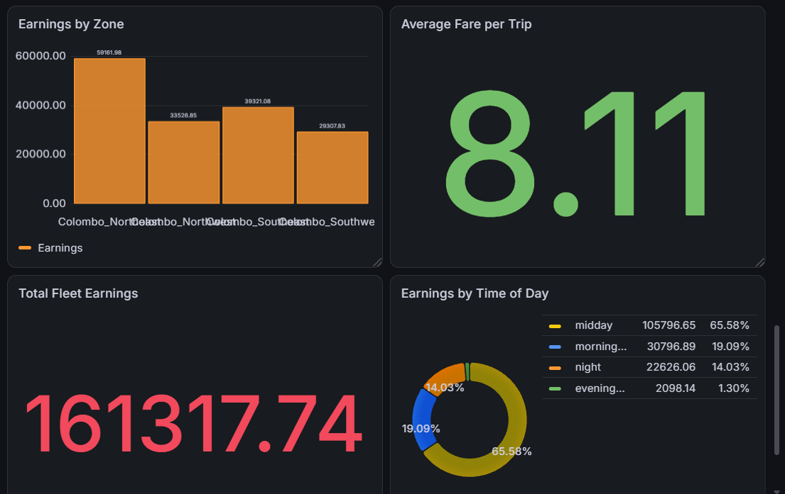

**Vehicle Profitability** — daily reconciliation of streaming earnings against yesterday's costs:

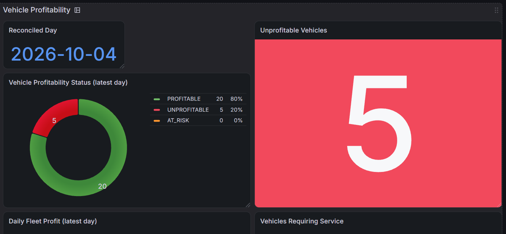
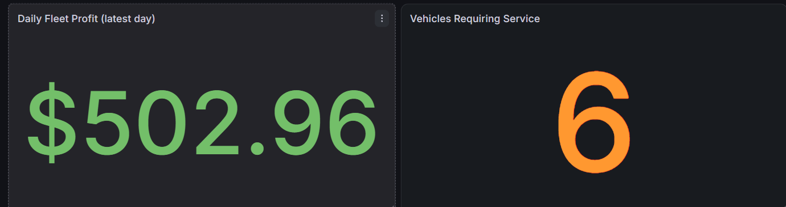
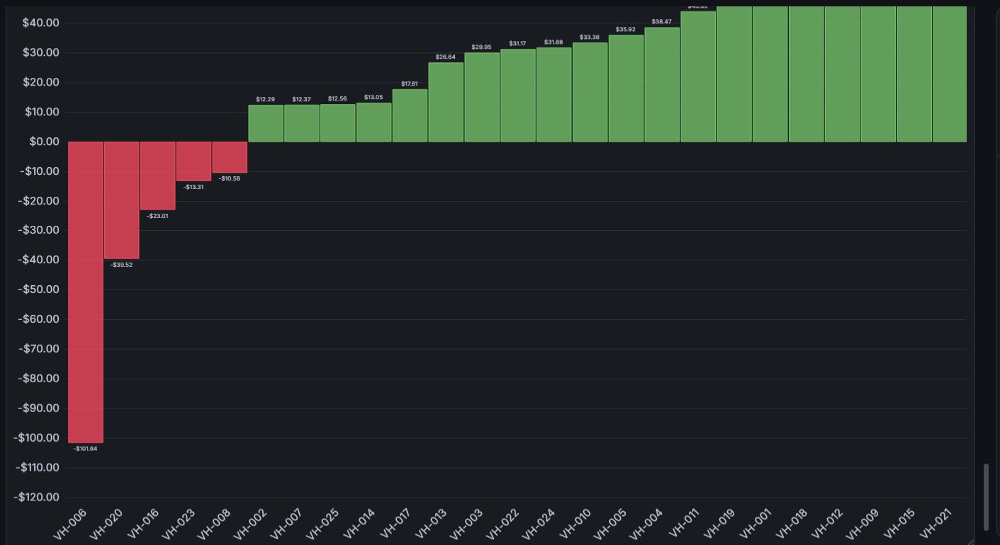

Example daily reconciliation (simulated day 2026-09-28): 22 profitable, 1 at risk,
2 unprofitable — the unprofitable vehicles are exactly the ones with a large
maintenance event that day:

| Vehicle | Earnings | Costs | Profit | Status |
|---|---|---|---|---|
| VH-025 | $64.24 | $180.93 | **−$116.69** | UNPROFITABLE |
| VH-016 | $55.09 | $142.36 | **−$87.27** | UNPROFITABLE |
| VH-015 | $62.39 | $59.22 | $3.17 (5 %) | AT_RISK |

**Prometheus alert rules** (9 rules, 3 groups):

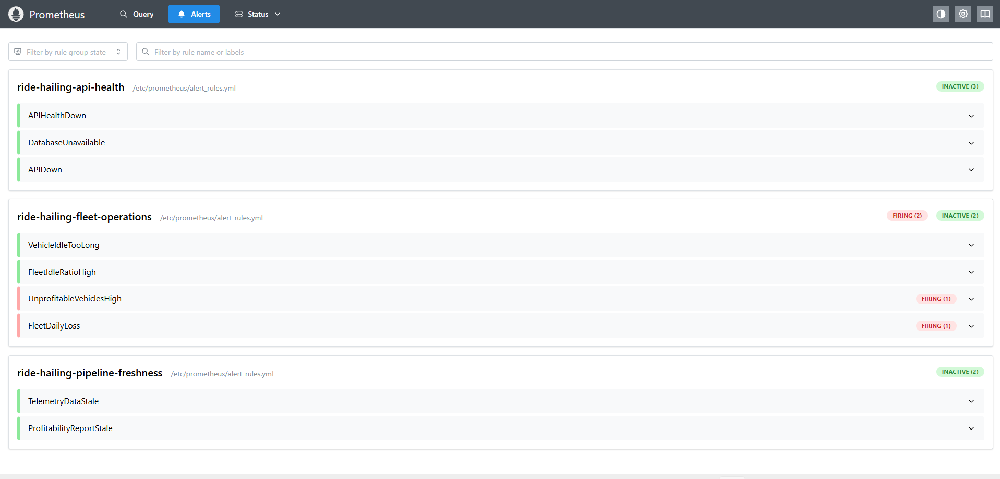

## 8. Real scenarios we tested

These failures were triggered on the running system; screenshots and log lines
are real.

### Scenario 1 - "No data received": telemetry producer stopped

The producer was stopped for ~90 s. Freshness passed 60 s and
`TelemetryDataStale` went **pending → firing**, then back to **inactive** after
restart.

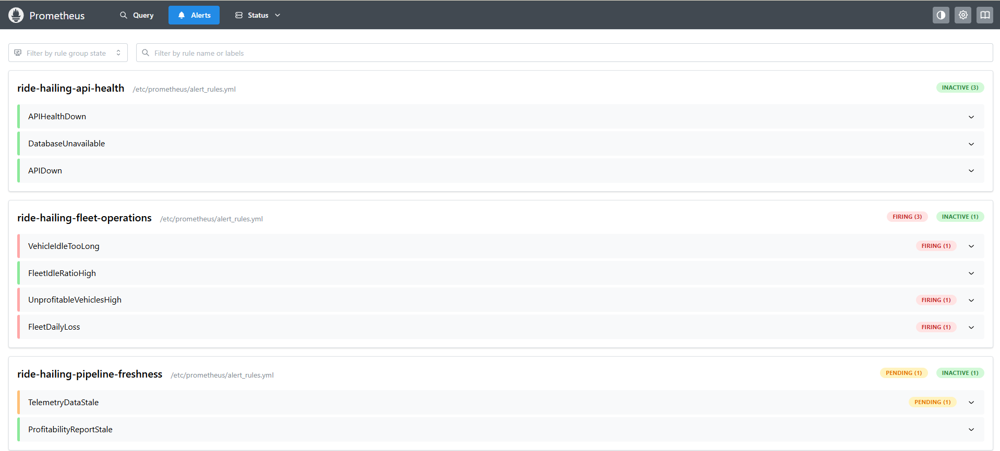
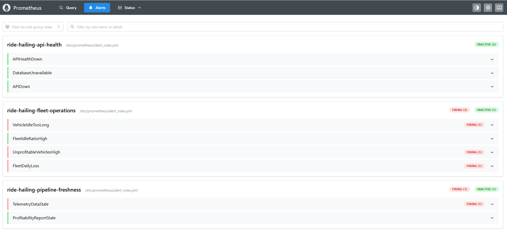
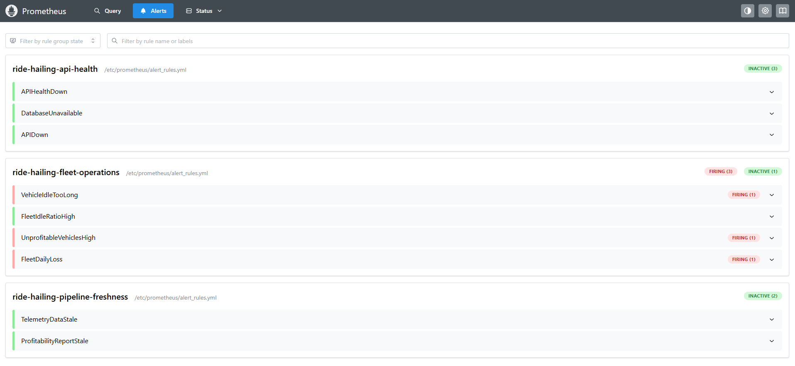

### Scenario 2 - Kafka broker outage (robust ingestion)

`docker stop ride-kafka` for ~20 s. The producer **did not crash**: it logged
each failed batch and resumed on its own when Kafka returned; Spark reconnected
and caught up.

```text
07:02:45 ERROR telemetry-producer ingestion telemetry_batch_failed  error=KafkaConnectionError: socket disconnected
07:02:58 ERROR telemetry-producer ingestion telemetry_batch_failed  error=KafkaTimeoutError: Timeout waiting for future
07:03:45 INFO  telemetry-producer ingestion telemetry_batch_published total_events=725
```

### Scenario 3 - Processing layer down: diagnose with logs

`docker stop ride-spark`. Freshness climbed to ~3 minutes and the stale alert
fired. The merged log showed **ingestion still healthy** (producer publishing
every 3 s) but **no Spark progress or writes** → fault located between Kafka and
PostgreSQL. After `docker start ride-spark` the backlog Kafka had buffered was
processed in one catch-up batch (`input_rows=3001`, 1,500 rows written) —
**no data lost**.

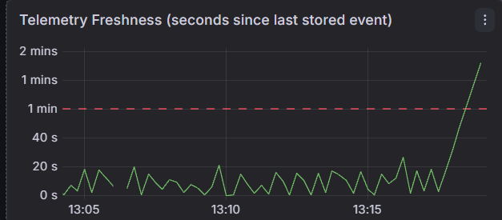
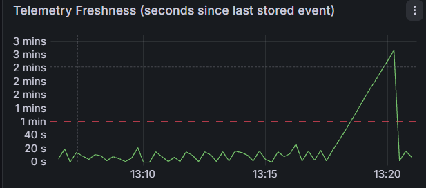

### Scenario 4 - A real bug found through the logs (Spark crash loop)

After a Spark restart the structured logs showed a loop:

```text
ERROR storage    postgres_write_failed  table=fleet_metrics batch_id=216  (duplicate key "fleet_metrics_pkey")
ERROR processing query_terminated
INFO  processing streaming_job_started        <- container restarted, same batch fails again
```

**Root cause:** `foreachBatch` is *at-least-once*. Spark replayed a micro-batch
that had already been written, and the plain JDBC append violated the primary
key on every restart. **Fix:** the fleet-metrics sink now writes to a staging
table and **upserts** (`INSERT … ON CONFLICT DO UPDATE`), so a replayed batch is
harmless. Verified by replaying 60 existing rows (`INSERT 0 60`, no error).

### Scenario 5 - Vehicle idle for too long

The producer occasionally puts a driver on an extended idle (2 % per trip,
~5–10 simulated hours). `VehicleIdleTooLong` fires for that vehicle and the
API lists it:

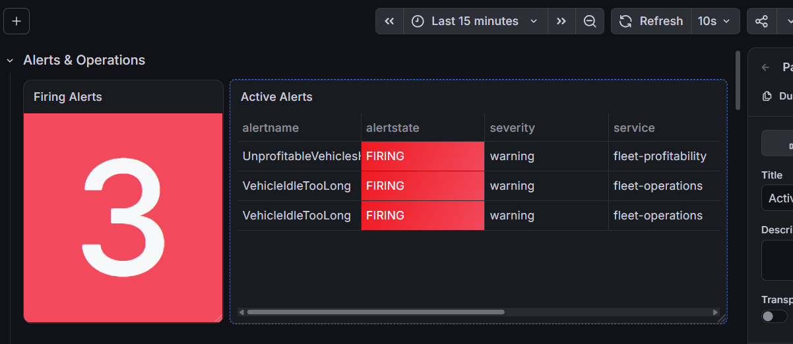

```json
{"threshold_minutes":180.0,"vehicles_idle_too_long":1,
 "vehicles":[{"vehicle_id":"VH-015","zone":"Colombo_Southeast","idle_minutes":518.7}]}
```

### Scenario 6 - API down: "who watches the watcher"

`docker stop ride-api`: `APIDown` (based on Prometheus' own scrape status) fired,
while the business alerts went silent because their metrics come from the API.

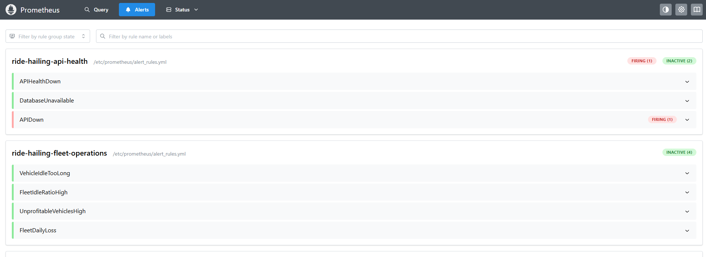

### Scenario 7 - Fresh clone on an empty machine

The repository was cloned into an empty folder and started with
`docker compose -p ridetest up -d --build` (separate, empty volumes). With no
manual steps: 5 tables were created by the init scripts, telemetry flowed after
~4 minutes, the Grafana dashboard appeared automatically, and the first daily
report (2026-09-28) was produced after ~10 minutes.

## 9. Automated tests

**44 tests** in `tests/`:

| File | Tests | Covers |
|---|---|---|
| `test_producers.py` | 15 | simulation clock, shared epoch, expense batch (25/day, deterministic, valid), telemetry schema, trip lifecycle, extended idle |
| `test_api.py` | 10 | endpoints with a fake database: health 200/503, idle threshold, report totals, 404/422/500, Prometheus metrics |
| `test_transformations.py` | 20 | Spark cleaning (7 invalid-event cases), zones, time-of-day buckets, event ids, windowed fleet metrics with final fare per trip |

Tests never touch the running pipeline (`tests/conftest.py` isolates the clock
and log files).

```bash
# producers + API (plain Python)
pip install -r requirements-dev.txt
python -m pytest tests -v
# -> 24 passed, 1 skipped
```

Spark transformations run inside the Spark image (built by `docker compose up --build`).
One line, works in PowerShell and bash:

```bash
docker run --rm -v "${PWD}:/project" -w /project -e HOME=/tmp -e PYTHONDONTWRITEBYTECODE=1 ride-hailing-data-engineering-platform-spark bash -c 'export PYTHONPATH=/opt/spark/python:$(ls /opt/spark/python/lib/py4j-*.zip); pip install -q --user --no-warn-script-location pytest==8.3.4; python3 -m pytest -v -p no:cacheprovider tests/test_transformations.py'
```

Expected: `20 passed`. (The image name assumes the project folder is called
`ride-hailing-data-engineering-platform`; check with `docker images`.)

## 10. Configuration

Defaults work out of the box. To change them, copy `.env.example` to `.env`.

| Variable | Default | Meaning |
|---|---|---|
| `SIMULATED_DAY_MINUTES` | `5` | Real minutes per simulated day |
| `SIMULATION_START_DATE` | `2026-09-28T00:00:00+00:00` | First simulated day |
| `TELEMETRY_INTERVAL_SECONDS` | `3` | Real seconds between telemetry batches |
| `LONG_IDLE_PROBABILITY` | `0.02` | Chance of an extended idle after a trip |
| `IDLE_ALERT_MINUTES` | `180` | API idle threshold in simulated minutes (API environment variable; the Prometheus rule `VehicleIdleTooLong` uses the same 180) |
| `POSTGRES_DB` / `POSTGRES_USER` / `POSTGRES_PASSWORD` | `ride_hailing` / `ride_admin` / `ride_password` | Database |

## 11. Troubleshooting

| Symptom | Cause / fix |
|---|---|
| Telemetry age `+Inf` right after start | Spark is still starting / downloading drivers - wait 3–5 min |
| "Last Reconciliation" huge right after start | No simulated day has finished yet - the first report appears after ~10 min |
| Grafana `ChunkLoadError` | Browser cache - **Ctrl + Shift + R** |
| Port already in use | Another service uses 3000/5433/8000/8080/9090/9092 — stop it or change the port in `docker-compose.yml` |
| Everything looks stale after a long pause | The simulated clock follows real time; days while the stack was down have no data. For a clean start: `docker compose down -v` and delete `data/processed/simulation_epoch.txt` |
| Where is it failing? | `python tools/pipeline_logs.py --since 10 --level ERROR` |

## 12. Project structure

```text
producers/        telemetry producer, daily expense generator, shared clock, JSON logging
spark/            Structured Streaming job, schemas, cleaning/aggregation transformations
airflow/dags/     daily expense + profitability reconciliation DAG
database/         schema init scripts + daily reconciliation SQL
api/              FastAPI serving layer and Prometheus metrics
monitoring/       Prometheus config + alert rules, Grafana provisioning (datasource + dashboard)
tools/            pipeline_logs.py — merged structured-log viewer
tests/            44 automated tests
docs/             screenshots and project documentation
data/  reports/  logs/   runtime output (git-ignored)
```

## 13. Known limitations

- **Single-node, local setup:** 1 Kafka broker, Spark `local[*]`, Airflow
  standalone (no persistent metadata DB) - not highly available.
- **Missed simulated days are not backfilled:** if the stack is down, those
  days get no expense batch or report.
- **Outages distort profitability:** a day with a telemetry gap looks less
  profitable; there is no data-completeness check yet.
- **At-least-once telemetry sink:** a replayed batch can duplicate a few raw
  telemetry rows (earnings and fleet state are not affected; fleet metrics and
  expenses are upserted).
- **`/metrics` queries PostgreSQL on every scrape** (~0.5–1.4 s); the P95
  latency panel over-states it because of coarse histogram buckets.
- **Container logs** (`docker logs`) are lost when a container is recreated;
  production would ship logs to a central store (e.g. Loki/Elasticsearch).

